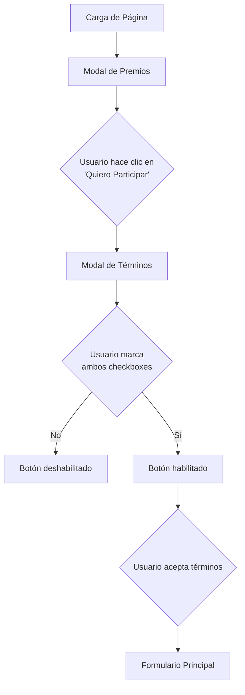
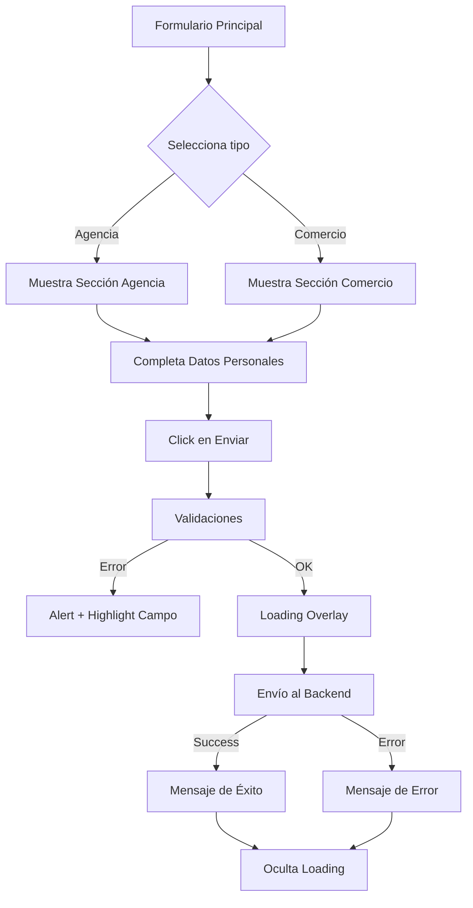
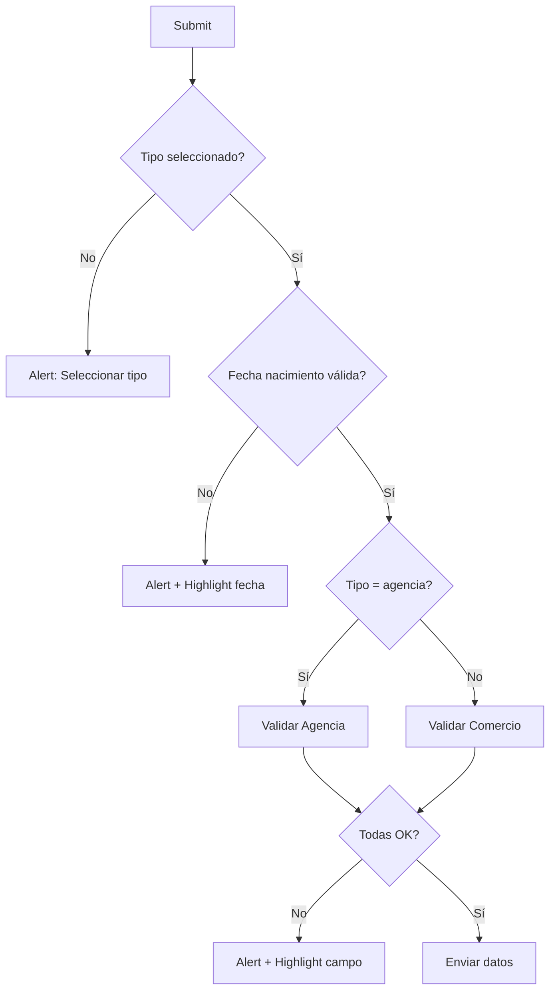
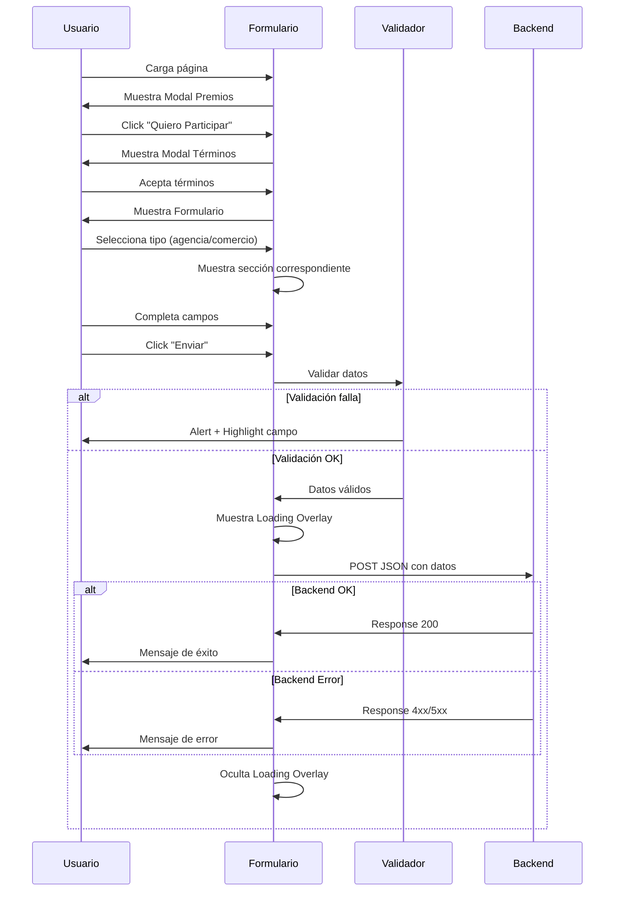

# Especificaciones Lógicas del Formulario
## Flujo de Trabajo y Validaciones - "El Centro Está de Fiesta"

---

## 1. Flujo de Usuario

### 1.1 Secuencia de Modales



### 1.2 Flujo del Formulario



---

## 2. Lógica de Modales

### 2.1 Modal de Premios
**Comportamiento Inicial**:
- Se muestra automáticamente al cargar la página
- No tiene clase `modal-hidden`

**Evento**:
```javascript
continuePrizesBtn.click → {
    prizesModal.classList.add('modal-hidden');
    termsModal.classList.remove('modal-hidden');
}
```

### 2.2 Modal de Términos
**Validación de Checkboxes**:
```javascript
function updateAcceptButton() {
    if (mayorEdadCheck.checked && terminosCheck.checked) {
        acceptTermsBtn.disabled = false;
    } else {
        acceptTermsBtn.disabled = true;
    }
}
```

**Evento de Cierre**:
```javascript
acceptTermsBtn.click → {
    termsModal.classList.add('modal-hidden');
}
```

### 2.3 Modales de Ayuda
**Apertura**:
```javascript
ocrHelpIcon.click → ocrHelpModal.classList.remove('modal-hidden');
agenciaHelpIcon.click → agenciaHelpModal.classList.remove('modal-hidden');
```

**Cierre**:
```javascript
closeOcrHelpBtn.click → ocrHelpModal.classList.add('modal-hidden');
closeAgenciaHelpBtn.click → agenciaHelpModal.classList.add('modal-hidden');
```

---

## 3. Lógica de Selección de Tipo

### 3.1 Radio Cards
**Comportamiento Visual**:
```javascript
radio.change → {
    // Remover clase 'selected' de ambas cards
    radioAgencia.classList.remove('selected');
    radioComercio.classList.remove('selected');
    
    // Agregar a la seleccionada
    if (value === 'agencia') {
        radioAgencia.classList.add('selected');
    } else {
        radioComercio.classList.add('selected');
    }
}
```

### 3.2 Mostrar/Ocultar Secciones
```javascript
if (value === 'agencia') {
    seccionAgencia.classList.remove('hidden');
    seccionComercio.classList.add('hidden');
    
    // Hacer campos de agencia obligatorios
    ocr.required = true;
    nroSucursal.required = true;
    nroAgencia.required = true;
    montoAgencia.required = true;
    
    // Remover obligatoriedad de comercio
    cuitLocal.required = false;
    nroComprobante.required = false;
    monto.required = false;
} else {
    // Inverso para comercio
}
```

**Nota**: Los campos de foto NO se marcan como `required` porque se validan manualmente en JavaScript.

---

## 4. Auto-Formato de Campos

### 4.1 CUIT del Comercio
**Formato Objetivo**: `XX-XXXXXXXX-X`

```javascript
cuitLocal.input → {
    value = value.replace(/\D/g, '');  // Solo dígitos
    if (value.length > 11) value = value.substring(0, 11);
    
    formatted = value.substring(0, 2);
    if (value.length > 2) {
        formatted += '-' + value.substring(2, 10);
        if (value.length > 10) {
            formatted += '-' + value.substring(10, 11);
        }
    }
}
```

### 4.2 Número de Comprobante
**Formato Objetivo**: `XXXX-XXXXXXXX`

```javascript
nroComprobante.input → {
    value = value.replace(/\D/g, '');
    if (value.length > 12) value = value.substring(0, 12);
    
    formatted = value.substring(0, 4);
    if (value.length > 4) {
        formatted += '-' + value.substring(4, 12);
    }
}
```

### 4.3 Campos Solo Numéricos
**Campos Afectados**: `ocr`, `nroSucursal`, `nroAgencia`, `dni`, `codigoArea`, `telefono`

```javascript
field.input → {
    value = value.replace(/\D/g, '');  // Elimina todo excepto dígitos
}
```

---

## 5. Validaciones del Formulario

### 5.1 Orden de Validación



### 5.2 Validación de Fecha de Nacimiento

**Regla**: Debe ser ≤ 09/12/2007 (mayor de 18 años)

```javascript
const maxDate = new Date('2007-12-09');
const birthDate = new Date(fechaNacimiento);

if (birthDate > maxDate) {
    alert('⚠️ FECHA NO VÁLIDA\n\nDebés ser mayor de 18 años...');
    
    // Highlight visual
    fechaInput.scrollIntoView({ behavior: 'smooth', block: 'center' });
    fechaInput.style.borderColor = '#ef4444';
    fechaInput.style.backgroundColor = '#fee2e2';
    
    // Remover highlight después de 3s
    setTimeout(() => {
        fechaInput.style.borderColor = '';
        fechaInput.style.backgroundColor = '';
    }, 3000);
    
    return;
}
```

### 5.3 Validaciones de Agencia

| Campo | Validación | Mensaje de Error |
|-------|------------|------------------|
| OCR | Exactamente 16 dígitos | "Por favor, ingresá el Número OCR completo (16 dígitos)" |
| Nº Agencia | 1 a 5 dígitos | "Por favor, ingresá el Número de Agencia (entre 1 y 5 dígitos)" |
| Monto | ≥ $5,000 | "El monto de la apuesta debe ser mayor o igual a $5.000" |
| Foto | Archivo presente | "⚠️ FOTO REQUERIDA\n\nPor favor, subí la foto del ticket de agencia..." |

### 5.4 Validaciones de Comercio

| Campo | Validación | Mensaje de Error |
|-------|------------|------------------|
| CUIT | Exactamente 13 caracteres | "Por favor, ingresá el CUIT del Comercio completo (formato: XX-XXXXXXXX-X)" |
| Nº Ticket | Exactamente 13 caracteres | "Por favor, ingresá el Número de Ticket o Factura completo (formato: XXXX-XXXXXXXX)" |
| Monto | ≥ $25,000 | "El monto de la compra debe ser mayor o igual a $25.000" |
| Foto | Archivo presente | "⚠️ FOTO REQUERIDA\n\nPor favor, subí la foto del ticket o factura..." |

### 5.5 Validación Visual de Fotos

**Comportamiento cuando falta foto**:
```javascript
if (!ticketFile) {
    // 1. Mostrar alert
    alert('⚠️ FOTO REQUERIDA\n\n...');
    
    // 2. Scroll al campo
    const fileLabel = document.querySelector('label[for="ticketId"]');
    fileLabel.scrollIntoView({ behavior: 'smooth', block: 'center' });
    
    // 3. Highlight visual
    fileLabel.style.borderColor = '#ef4444';
    fileLabel.style.backgroundColor = '#fee2e2';
    fileLabel.style.animation = 'shake 0.5s';
    
    // 4. Remover highlight después de 3s
    setTimeout(() => {
        fileLabel.style.borderColor = '';
        fileLabel.style.backgroundColor = '';
        fileLabel.style.animation = '';
    }, 3000);
    
    return;
}
```

---

## 6. Lógica de Envío

### 6.1 Preparación de Datos

```javascript
// 1. Obtener género
const genero = document.querySelector('input[name="sexo"]:checked')?.value || '';

// 2. Construir objeto base
const jsonData = {
    tipo: tipoCompra.value,
    persona: {
        apellido: document.getElementById('apellido').value,
        codigo_area: document.getElementById('codigoArea').value,
        correo_electronico: document.getElementById('email').value,
        dni: document.getElementById('dni').value,
        fecha_nacimiento: document.getElementById('fechaNacimiento').value,
        nombre: document.getElementById('nombre').value,
        genero: genero,
        telefono: document.getElementById('telefono').value
    }
};

// 3. Agregar datos específicos según tipo
if (tipo === 'agencia') {
    const file = document.getElementById('ticketAgencia').files[0];
    const base64Image = await fileToBase64(file);
    
    jsonData.agencia = {
        foto_ticket: base64Image,
        foto_tipo: file.type,
        id_persona: '',
        monto_apuesta: document.getElementById('montoAgencia').value.toString(),
        nro_agencia: document.getElementById('nroAgencia').value,
        nro_sucursal: document.getElementById('nroSucursal').value,
        ocr: document.getElementById('ocr').value
    };
} else {
    // Similar para comercio
}
```

### 6.2 Conversión de Imagen a Base64

```javascript
function fileToBase64(file) {
    return new Promise((resolve, reject) => {
        const reader = new FileReader();
        reader.readAsDataURL(file);
        reader.onload = () => {
            // Remover prefijo "data:image/xxx;base64,"
            const base64 = reader.result.split(',')[1];
            resolve(base64);
        };
        reader.onerror = error => reject(error);
    });
}
```

### 6.3 Envío al Backend

```javascript
// 1. Mostrar loading
loadingOverlay.classList.remove('hidden');
submitBtn.disabled = true;

try {
    // 2. Enviar datos
    const response = await fetch(BACKEND_URL, {
        method: 'POST',
        headers: {
            'Content-Type': 'application/json'
        },
        body: JSON.stringify(jsonData)
    });
    
    // 3. Procesar respuesta
    if (response.ok) {
        const data = await response.json();
        showResponse(true, data.message || 'Participación enviada exitosamente');
    } else {
        const errorData = await response.json();
        const errorMessage = errorData.message || `Error ${response.status}`;
        showResponse(false, errorMessage, response.status);
    }
    
} catch (error) {
    showResponse(false, error.message);
    
} finally {
    // 4. Ocultar loading
    loadingOverlay.classList.add('hidden');
    submitBtn.disabled = false;
}
```

---

## 7. Lógica de Respuestas

### 7.1 Función showResponse

```javascript
function showResponse(success, message, statusCode = null) {
    responseContainer.innerHTML = `
        <div class="${success ? 'success-box' : 'error-box'} p-6 rounded-lg">
            <div class="text-6xl mb-4">${success ? '✅' : '❌'}</div>
            <h3 class="text-2xl font-bold mb-2">
                ${success ? '¡Éxito!' : 'Error'}
            </h3>
            <p class="text-lg">${message}</p>
            ${statusCode ? `<p class="text-sm mt-2">Código: ${statusCode}</p>` : ''}
        </div>
    `;
    
    responseContainer.classList.remove('hidden');
    responseContainer.scrollIntoView({ behavior: 'smooth' });
}
```

---

## 8. Reglas de Negocio

### 8.1 Montos Mínimos
- **Agencia**: $5,000
- **Comercio**: $25,000

### 8.2 Edad Mínima
- **Fecha máxima**: 09/12/2007
- **Edad**: 18 años cumplidos

### 8.3 Formatos de Documento
- **DNI**: 7 u 8 dígitos
- **CUIT**: XX-XXXXXXXX-X (11 dígitos con guiones)
- **OCR**: 16 dígitos exactos
- **Nº Agencia**: 1 a 5 dígitos
- **Nº Ticket**: XXXX-XXXXXXXX (12 dígitos con guión)

### 8.4 Imágenes
- **Formatos aceptados**: JPG, PNG, WebP
- **Conversión**: Base64 sin prefijo
- **Validación**: Obligatoria según tipo seleccionado

### 8.5 Medio de Pago (Comercio)
- **Opciones**: Bancor, Otros
- **Comportamiento**: Opcional
- **Doble chance**: Si paga con Bancor (según términos)

---

## 9. Estados del Formulario

### 9.1 Estados de Campos

| Estado | Condición | Estilo |
|--------|-----------|--------|
| Normal | Default | `border-gray-300` |
| Focus | Campo activo | `border-blue-500`, `translateY(-2px)` |
| Error | Validación fallida | `border-red-500`, `bg-red-50`, `shake` |
| Disabled | Submit en proceso | `opacity-0.6`, `cursor-not-allowed` |

### 9.2 Estados de Botones

| Botón | Estado | Condición |
|-------|--------|-----------|
| Accept Terms | Disabled | Checkboxes no marcados |
| Accept Terms | Enabled | Ambos checkboxes marcados |
| Submit | Disabled | Durante envío |
| Submit | Enabled | Formulario listo |

### 9.3 Estados de Secciones

| Sección | Visible cuando |
|---------|----------------|
| Agencia | `tipoCompra === 'agencia'` |
| Comercio | `tipoCompra === 'comercio'` |
| Loading Overlay | Durante envío al backend |
| Response Container | Después de recibir respuesta |

---

## 10. Manejo de Errores

### 10.1 Errores de Validación
- **Acción**: Alert + Highlight campo + Scroll
- **Duración highlight**: 3 segundos
- **Animación**: Shake (0.5s)

### 10.2 Errores de Red
- **Captura**: try/catch en fetch
- **Mensaje**: Error genérico del exception
- **Display**: showResponse(false, error.message)

### 10.3 Errores del Backend
- **Detección**: response.ok === false
- **Mensaje**: Desde response.json().message o status code
- **Display**: showResponse(false, errorMessage, statusCode)

---

## 11. Comportamientos Especiales

### 11.1 Actualización de Nombre de Archivo
```javascript
function updateFileName(input, spanId) {
    const fileName = input.files[0]?.name || 'Hacé clic para subir...';
    document.getElementById(spanId).textContent = fileName;
}
```

### 11.2 Sucursal Fija
- Campo `nroSucursal` es **readonly**
- Valor fijo: "01 - CASA CENTRAL"
- No editable por el usuario

### 11.3 Scroll Suave
- Usado en: Errores de validación, respuestas
- Configuración: `{ behavior: 'smooth', block: 'center' }`

---

## 12. Flujo Completo de Datos


